# **ANNAPURNA - Food Waste Management Platform**

ANNAPURNA is a platform designed to connect food donors with NGOs to reduce food waste and help underprivileged communities. The platform facilitates the process of donating food by providing an easy-to-use system for donors, receivers (NGOs), and volunteers, ensuring efficient data management, seamless communication, and secure user authentication.

---

## **Table of Contents**
1. [Project Overview](#project-overview)
2. [Features](#features)
3. [Technology Stack](#technology-stack)
4. [Benefits](#benefits)
5. [Screenshots](#screenshots)
6. [Installation & Running Locally](#installation--running-locally)
7. [Contributor](#contributor)

---

## **Project Overview**

ANNAPURNA is a food waste management platform aimed at reducing food waste by connecting individuals or organizations with surplus food to NGOs who distribute it to those in need. This platform offers a streamlined process for handling food donations by leveraging modern web technologies.

### Key Modules:
- **Donors**: Register and post food donations.
- **Receivers (NGOs)**: Browse and claim available donations.
- **Volunteers**: Assist in facilitating donations.
- **Authentication**: Secure login for all users.

---

## **Features**

- **Donor Registration**: Easy signup and login for food donors.
- **Food Donations**: Donors can list food donations with quantity, type, and location.
- **NGO Registration**: NGOs can register, browse, and claim donations by filling the form.
- **Volunteers**: Users can also fill the form for being volunteer and help in transporting food and coordinating between donors and NGOs.
- **Secure Data Management**: All data is securely stored using PostgreSQL.
- **API Integration**: 8 seamless APIs for donor, Receivers(NGO), volunteer management, and authentication.
  
---

## **Technology Stack**

- **Frontend**: HTML, CSS, JavaScript
- **Backend**: Node.js, Express.js
- **Database**: PostgreSQL
- **APIs**: Implemented with Express.js
- **Hosting**: Local server for testing

---

## **Benefits**

1. **Reduces Food Waste**: Connects surplus food with those who need it.
2. **Simplifies Donation Process**: Easy-to-use interface for all stakeholders.
3. **Community Impact**: Supports NGOs in feeding underprivileged communities.
4. **Secure and Efficient**: Ensures data security through secure database integration.

---

## **Screenshots**

<table>
  <tr>
    <td>
      <strong>Homepage</strong><br>
      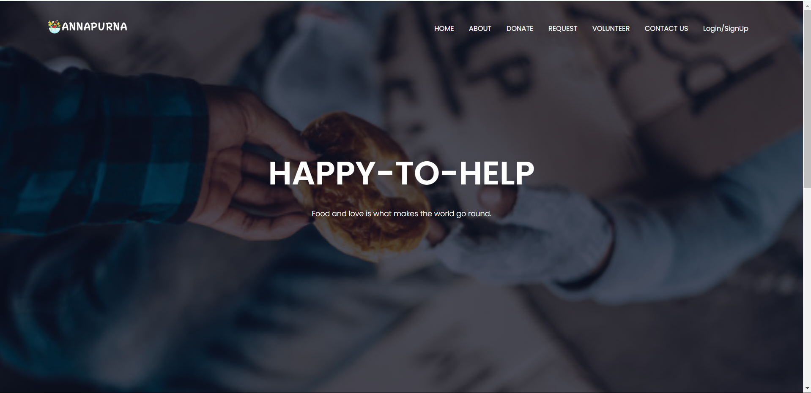
    </td>
    <td>
      <strong>Features</strong><br>
      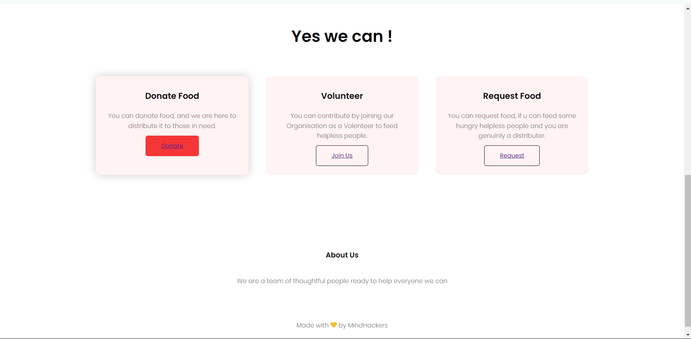
    </td>
  </tr>
  <tr>
    <td>
      <strong>Donars Section</strong><br>
      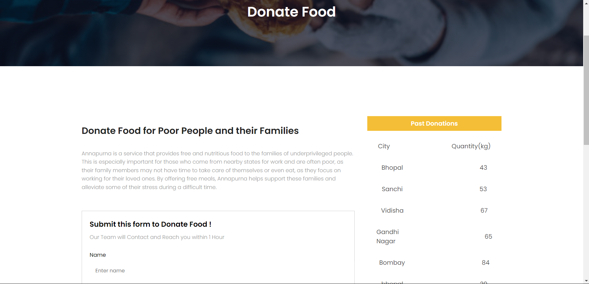
    </td>
    <td>
      <strong>NGO Dashboard</strong><br>
      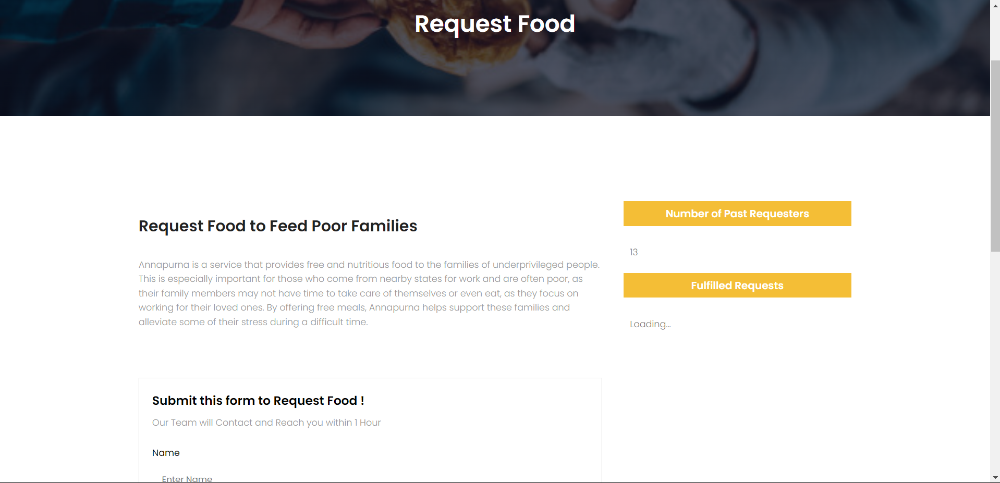
    </td>
  </tr>
  <tr>
    <td>
      <strong>Volunteer Section</strong><br>
      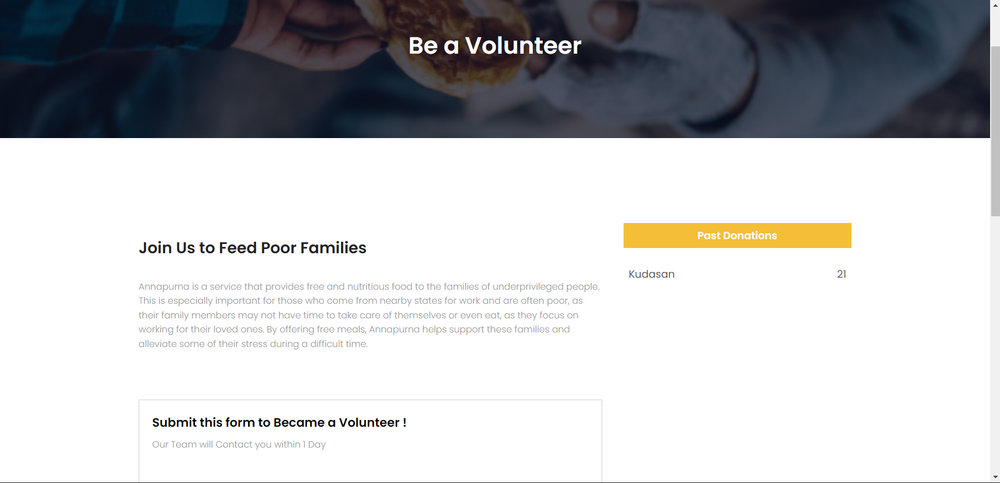
    </td>
    <td>
       <strong>Contact Us Section</strong><br>
      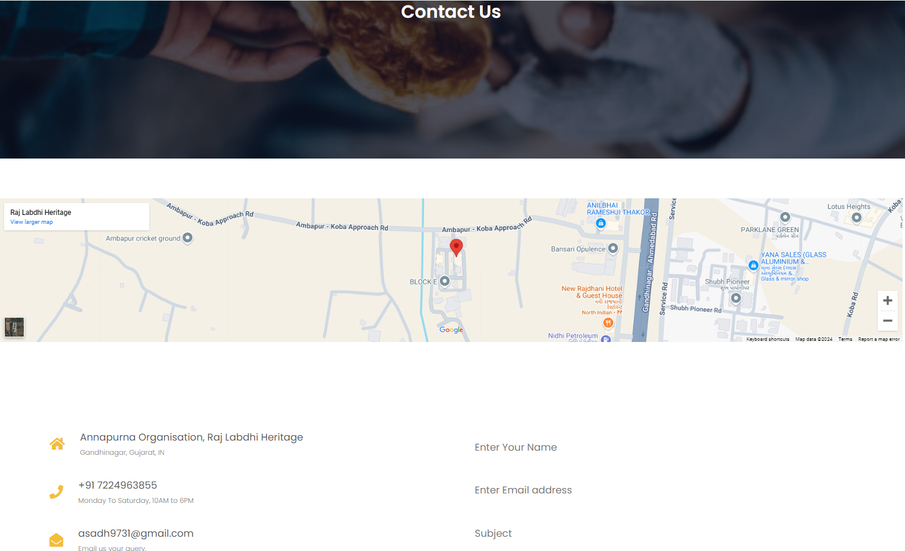
    </td>
  </tr>
  <tr>
    <td>
      <strong>Sign Up page</strong><br>
      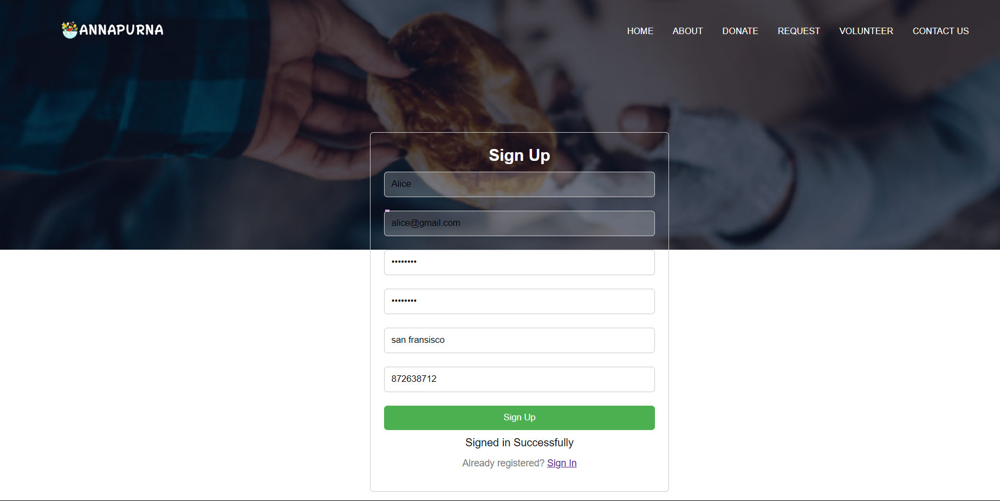
    </td>
    <td>
       <strong>Sign In page</strong><br>
      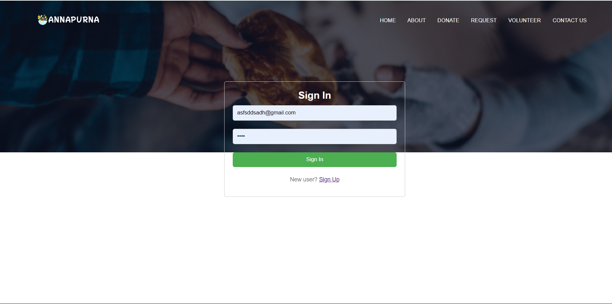
    </td>
  </tr>
  <tr>
    <td>
      <strong>Donar database table</strong><br>
      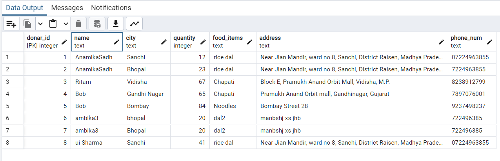
    </td>
    <td>
       <strong>Receiver database table</strong><br>
      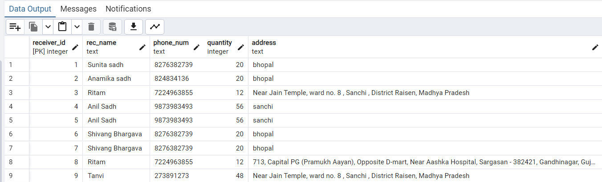
    </td>
  </tr>
  <tr>
    <td>
      <strong>Volunteer database table</strong><br>
      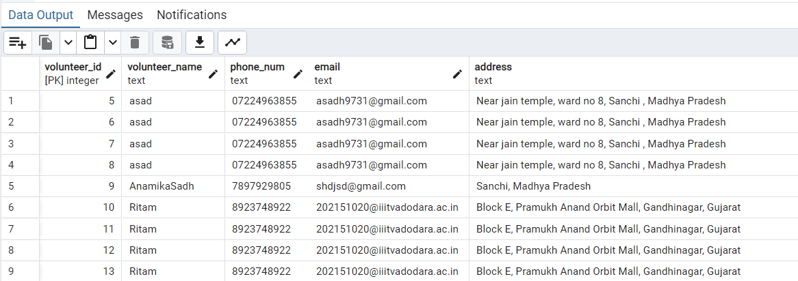
    </td>
    <td>
       <strong>Users database table</strong><br>
      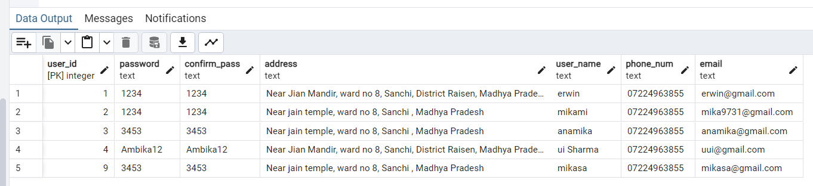
    </td>
  </tr>
</table>


---

## **Installation & Running Locally**

### **Prerequisites**
- **Node.js**: Download and install from [Node.js](https://nodejs.org/).
- **PostgreSQL**: Ensure you have PostgreSQL installed and running.

### **Steps to Set Up Locally**

1. **Clone the Repository**
 ```bash
 git clone https://github.com/yourusername/annapurna.git
 cd annapurna
 ```


2. **Install Dependencies** 
  ```bash
  npm init -y
  ```
  ```
  npm install express pg body-parser multer
  ```
3. **Set Up Database**

Create a PostgreSQL database and configure the connection details in backend/API/connections.js.

4. **Run the Backend Server**
  Navigate to the backend folder and start the backend server:
  ```bash
  node API/controller.js
  ```
5. **Run the Frontend Server**
```bash
npm install -g live-server
```
```bash
live-server frontend/
```
6. **Access the Application**
Open your browser and go to http://localhost:8040.

7. **Testing the API**
To test the API endpoints, I used Thunder Client, we can also use Postman for testing the APIs endpoint.

---

## **Contributor:**
***Anamika Sadh***

